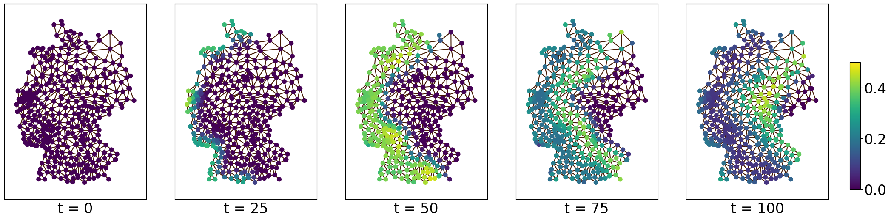

# Temporal Waves on Graphs

### Reference
Paper not published yet.

## Datasets Access and Usage

|Name | Nodes | Edges| Time-steps |
| --- | --- | --- | ---|
|[SI-diffusion Equation](/data/SI_diffusion_equation) | 400 | 2088 | 9100 |
|[Wave Equation](/data/wave_equation) | 325 | 1858 | 960 | 
|[Advection-Diffusion Equation](/data/advection_difusion_equation) | 400 | 2088 | 4320 |  


### Access via our PyTorch Dataset Classes
To directly instantiate the PyTorch [dataset](https://pytorch.org/docs/stable/data.html#torch.utils.data.Dataset) classes, navigate to the ```/ml``` directory and use the following code snippet:

```python
from torch.utils.data import DataLoader
from dataset import SIDiffusionEquationDataset  # Alternatives: WaveDataset, AdvectionDiffusionDataset

# Instantiate the dataset
dataset = SIDiffusionEquationDataset(context_len=14, forecast_len=14)

train_dataloader = DataLoader(dataset, batch_size=1, shuffle=True)

context, target = next(iter(train_dataloader))

print(f"Context dimensions: {context.shape}") # (batch_size, context_len, num_nodes)
print(f"Target dimensions: {target.shape}") # (batch_size, forecast_len, num_nodes)

```

In this instance, the transform parameter allows for the injection of noise into the context window, enhancing the robustness of your model. For practical implementations of noise addition, such as additive Gaussian noise or data ablation techniques, refer to [utils.py](/ml/utils.py).

Alternatively, you may use the function ```utils.get_dataset(key, config, train)``` with the desired configuration that contains the context window length, forecast length, and noise settings:

```python
def get_dataset(key, config, train):
        key (str): The key to identify the dataset type. Possible values are:
            - 'simulation': for the SIDiffusionEquationDataset
            - 'wave': for the WaveEquationDataset
            - 'advection': for the AdvectionDiffusionEquationDataset
        config (SimpleNamespace): The configuration object given by the ConfigLoader.
        train (bool): A flag indicating whether the dataset is for training or evaluation. This is used to differentiate between using the train/evaluation noise setting.
```
### Access via Pytorch Geometric Temporal
We have requested the augmentation of our dataset in the [collection of PyTorch Geometric Temporal](https://pytorch-geometric-temporal.readthedocs.io/en/latest/modules/dataset.html).
A finalized pull-request is upon acceptance of our paper.

### Access the Raw NumPy Data
The data of one of the three datasets can be found 
in the [/data/](/data) directory and
can be loaded and used with only numpy.
Executing the following numpy code

```python
import numpy as np
a = np.load("/data/SI_diffusion_equation/364_25_numpy_dataset.npy")
print(a.shape)
```
will load the epidemiological dataset and reveal that it has a shape of ``` (9100, 400, 2) ``` which refers
to 9100 timesteps, 400 locations/nodes/NUTS3 regions, and two values: 
Susceptible and Infected.

The Nodes are the alphabetically ordered NUTS3 regions. Their 
adjacencies and distances can be found in the file ```data/adjacency/nuts3_adjacent_distances.pt```, 
which can directly loaded as a PyTorch tensor with the
following code:


```python
dist = torch.load("nuts3_adjacent_distances.pt").T
edge_index = dist[:2, :].int()
dist = dist[2,:]
```

will return an edge_index of 2088 connection, and their distances.


## Training and Evaluating the Machine Learning Models on the Data
### Benchmarking the Models from the Paper

You can use Python version 3.9 for the environment, later versions should also work but we have not tested it.
To run a training or evaluation of any models we recommend creating a virtual environment with [pip](https://pypi.org/project/pip/) and installing
the required packages by running  ```pip install -r ./requirements.txt```.

We provide all models from the paper in the [/ml/ directory](/ml), namely
1. [RNN](/ml/rnn)
2. [Time-Series Transformer](/ml/tst)
3. [MP-PDE](/ml/mp_pde)
4. [RNN-GNN-Fusion](/ml/rnn_gnn_fusion)
5. [GraphEncoding](/ml/graph_encoding)

In order to start the training process for any model, simply navigate to the respective model directory and run the training script with ```python train_<model_name>.py```.

Model definitions can be found in [ml/models.py](ml/models.py). You can set the hyperparameters and other training-related variables by modifying the corresponding configuration file: `ml/<model_name>/<model_name>.yml`.
In the configuration, you have the option to set `num_eval_runs` and `num_train_runs` to adjust for randomization effects, such as initialization for training and the dataset noise for evaluation.

When the training process finishes; the model, loss plot, and branch plot will be saved into a directory named `<model_name>_<run_number>_<training_dataset>`. 

After training, you can run the evaluation scripts with: ```python evaluate_<model_name>.py```

When the evaluation scripts finish, the day-specific losses will be written to a file named `<model_name>_<eval_dataset>_daily_losses`.

### Running the Experiments in the Paper

You can train and evaluate all the models described in the paper by using the provided scripts. While the exact results may vary due to randomization, the process outlined here will allow you to replicate the overall experimental setup.

- To **train** all models jointly, use the following script:
  ```bash
  ./run_all_training.sh
  ```
- To **evaluate** the models, use the following script:
  ```bash
  ./run_all_evals.sh
  ```

For different tasks, you will need to modify the corresponding configuration files to suit the specific task you wish to run. For most tasks, the difference will lie in the noise settings in the configuration.

### Benchmarking New Custom Models

To benchmark a new model:

1. **Add Your Model:**
   - Define your model in `models.py`.

2. **Create Training and Evaluation Scripts:**
   - Copy an existing model directory (e.g., `rnn`), rename it to match your model (e.g., `my_model`).
   - Rename and edit the files inside (e.g., `train_rnn.py` → `train_my_model.py`).
   - Update the `.yml` config file with your model's parameters.

3. **Modify the Scripts:**
   - In `train_my_model.py`, replace the model instantiation, For instance:
     ```python
     model = models.RNN(...)
     ```
     with your new model:
     ```python
     model = models.MyModel(...)
     ```
   - Update `evaluate_my_model.py` similarly to load and evaluate your model.

4. **Run and Analyze:**
   - Train your model: `python ml/my_model/train_my_model.py`
   - Evaluate your model: `python ml/my_model/evaluate_my_model.py`
   - Review the results saved in the output directory.

## Recreating the Datasets

To recreate the datasets the PDE solver can easily be run.
### Requirements
Installation of *deal.ii* using official the
[deal.ii installation](https://dealii.org/download.html). As this is tested on 
Ubuntu, this can be done with

```
apt-get install libdeal.ii-dev
```

There are three simulations, to exemplary execute the simulation of the
wave equation run the following:

### Running the Simulation

1. ``` cd pde_solver/wave_equation/ ```
2. ``` cmake . ```
3. ``` make run ```

The other equations work analogously.
Note that in the three directories corresponding to the three PDEs, there are 
the different files: **simulation.cc** contains the relevant C++ code, 
**CMakesLists.txt** helps to create the executables, **.msh** file contains the
mesh necessary for the FEM, and **.csv** contains the
coordinates of the points on which the solutions are evaluated.

### Visualizing the Results and packing them into a Dataset

Running the simulation as described above will result in multiple CSVs and .vtk
 files, named after the simulation and its respective timestep. VKT files can be
 visualized with 
[ParaView](https://gitlab.kitware.com/paraview/paraview/-/tree/master). The CSVs
 have to be concatenated to form a new dataset, as for every time-step one CSV is
 generated.

 ### Possible Changes to the PDEs
 We propose some quick changes to the proposed PDE solvers. Nevertheless, to 
 effectively implement individual changes the user probably has to acquire more knowledge 
 of the underlying deal.ii libaray and we strongly suggest reading through the 
 [tutorials](https://www.dealii.org/current/doxygen/deal.II/Tutorial.html)
 in its documentation.
 #### Changing the sampling points on a domain
 To increase the amount of sampling points of a simulation, one has to provide a
 list with the required sampling points. We demonstrate this exemplary for the wave equation.
 For a quick demonstration, we have prepared a csv file with sampling points, that do lie
 in the required domain. This file can be found under can be found under [/additional_resources/Germany_coastline_points_increased.csv](/additional_resources/Germany_coastline_points_increased.csv).

 The creation of this file requires some knowledge about the domain. We have provided our code
 to generate a similar csv file as a [jupyter notebook](/additional_resources/point_and_mesh_generation.ipynb).
 In this file we generated 4000 random points on a rectangle containing the domain, removed points outside of
 the domain and additionally created a graph within the domain. Further we provide a short snipped that creates a *.msh* 
 file, necessary for gmsh. For further information we refer to the documentation of *deal.ii* and [gmsh](https://gmsh.info), especially
 [this tutorial](https://www.dealii.org/current/doxygen/deal.II/step_49.html).
 Please note that generating sampling points from a bounding box and checking if these points lie within the domain is possible in *deal.II* using the ``` is_inside ``` function. However, this approach requires a significantly deeper understanding of the deal.II library compared to simply loading a list of precomputed points.

 However, by replacing the [old csv file](/pde_solver/wave_equation/Germany_coastline_points.csv) with a [new csv file](/additional_resources/Germany_coastline_points_increased.csv),
 the evaluate the solution for all new 2970 sampling points. This can be done by replacing the string in in the following line
 
``` std::ifstream file("Germany_coastline_points.csv"); ```

The results of this simulation can be found [additional_resources/wave_dataset_larger.npy](/additional_resources/wave_dataset_larger.npy).

#### Increasing the temporal resolution of a Simulation
To change the temporal resolution of the simulation, how simply has to edit the stepsize of the FEM solver. 
For the Advection-Diffusion equation we have set a stepsize of $h=10^9/8$, which in the code of [simulation.cc](/pde_solver/wave_equation/simulation.cc) 
is set via
``` time_step(1e9 / 8) ```.

To increase the temporal resolution to $h=10^{8}/8$, one has simply to change edit this line and run the code again as described.
Note, that in the function ```output_results``` both VKT and CSV files were name to have only timesteps of 4 digits. Since we increased the temporal resolution to $h=10^{8}/8$ we expect
43500 timesteps and therefore have to increase this to a 5 digit number for both names.


#### Changing the domain of an equation
 We want to refer to the tutorial above. If the PDE should be solved on a different domain,
 one needs to replace the *.msh* file in the regarding simulation. The *.msh* file is created 
 with *gmsh*, and we refer to the [this tutorial](https://www.dealii.org/current/doxygen/deal.II/step_49.html) 
 from above again and [this examplary jupyter notebook](/additional_resources/point_and_mesh_generation.ipynb).
 
 Note that if parameters of the PDE, such as initialization, boundary values, or the diffusion parameter ($D$), are space-dependent, they need to be readjusted in the event of a domain interchange.
 
 #### Changing advection field (wind-direction) in the Advection-Diffusion Equation
 To change the advection field, one simply has to chose a new advection field
 $$\beta (x,t) \in \mathbb{R}^2$$. To do so, one simply has to modify the class 
``` class AdvectionField ``` in [simulation.cc](/pde_solver/wave_equation/simulation.cc), which contains the function
``` AdvectionField<dim>::value(const Point<dim> &p) ``` to return a value depending on space and time. For more information on this, we refer to especially
[step-4 of the deal.ii tutorials](https://www.dealii.org/current/doxygen/deal.II/step_4.html).


 #### Adding a new PDE
 Writing a solver for a new PDE from scratch is a challenging task. For guidance, we refer to the standard literature on the finite element method and [tutorial page of *deal.ii*](https://www.dealii.org/current/doxygen/deal.II/Tutorial.html), the library we used. This page covers a vast array of common PDEs and techniques necessary for implementing custom PDE solvers, expanding dimensionalities, exchanging domains, and much more.

 
If a desired PDE is already covered in the library's tutorials and the parameters are suitable, the reader only needs to evaluate the solution on the desired set of points right after the solution is calculated to create a dataset similar to ours. In our code for the [wave_equation](/pde_solver/wave_equation/simulation.cc), this is done in the function ```output_results() ```.

 


## Directory Tour
```
📦TemporalWavesOnGraphs
┣ 📂additional_resources
 ┃ ┣ 📜Germany_coastline_points_increased.csv
 ┃ ┣ 📜germany_coastline_adjacency_increased
 ┃ ┗ 📜point_and_mesh_generation.ipynb
 ┣ 📂data
 ┃ ┣ 📂SI_diffusion_equation
 ┃ ┃ ┣ 📜SI_equation_dataset.npy
 ┃ ┃ ┗ 📜nuts3_adjacent_distances.pt
 ┃ ┣ 📂advection_diffusion_equation
 ┃ ┃ ┣ 📜advection_diffusion_dataset.npy
 ┃ ┃ ┗ 📜nuts3_adjacent_distances.pt
 ┃ ┣ 📂wave_equation
 ┃ ┃ ┣ 📜germany_coastline_adjacency.pt
 ┃ ┃ ┗ 📜wave_equation_dataset.npy
 ┃ ┗ 📜LICENSE
 ┣ 📂imgs
 ┃ ┣ 📜.gitkeep
 ┃ ┗ 📜Graph-image-2.png
 ┣ 📂ml
 ┃ ┣ 📂graph_encoding
 ┃ ┃ ┣ 📜evaluate_graph_encoding.py
 ┃ ┃ ┣ 📜graph_encoding.yml
 ┃ ┃ ┗ 📜train_graph_encoding.py
 ┃ ┣ 📂mp_pde
 ┃ ┃ ┣ 📜evaluate_mp_pde.py
 ┃ ┃ ┣ 📜mp_pde.yml
 ┃ ┃ ┗ 📜train_mp_pde.py
 ┃ ┣ 📂repetition
 ┃ ┃ ┣ 📜README.md
 ┃ ┃ ┣ 📜evaluate_repetition.py
 ┃ ┃ ┗ 📜repetition.yml
 ┃ ┣ 📂rnn
 ┃ ┃ ┣ 📜evaluate_rnn.py
 ┃ ┃ ┣ 📜rnn.yml
 ┃ ┃ ┗ 📜train_rnn.py
 ┃ ┣ 📂rnn_gnn_fusion
 ┃ ┃ ┣ 📜evaluate_rnn_gnn_fusion.py
 ┃ ┃ ┣ 📜rnn_gnn_fusion.yml
 ┃ ┃ ┗ 📜train_rnn_gnn_fusion.py
 ┃ ┣ 📂tst
 ┃ ┃ ┣ 📜evaluate_tst.py
 ┃ ┃ ┣ 📜train_tst.py
 ┃ ┃ ┗ 📜tst.yml
 ┃ ┣ 📜config_loader.py
 ┃ ┣ 📜dataset.py
 ┃ ┣ 📜default_config.yml
 ┃ ┣ 📜models.py
 ┃ ┣ 📜requirements.txt
 ┃ ┣ 📜run_all_evals.sh
 ┃ ┣ 📜run_all_trainings.sh
 ┃ ┗ 📜utils.py
 ┣ 📂pde_solver
 ┃ ┣ 📂Advection_diffusion
 ┃ ┃ ┣ 📜CMakeLists.txt
 ┃ ┃ ┣ 📜Germany.msh
 ┃ ┃ ┣ 📜germany_centers.csv
 ┃ ┃ ┗ 📜simulation.cc
 ┃ ┣ 📂SI_diffusion
 ┃ ┃ ┣ 📜CMakeLists.txt
 ┃ ┃ ┣ 📜Germany.msh
 ┃ ┃ ┣ 📜germany_centers.csv
 ┃ ┃ ┗ 📜simulation.cc
 ┃ ┣ 📂wave_equation
 ┃ ┃ ┣ 📜CMakeLists.txt
 ┃ ┃ ┣ 📜Germany_coastline.msh
 ┃ ┃ ┣ 📜Germany_coastline_points.csv
 ┃ ┃ ┣ 📜README.md
 ┃ ┃ ┗ 📜simulation.cc
 ┃ ┗ 📜LICENSE
 ┣ 📜Croissant_metadata.json
 ┗ 📜README.md
```

## License

Note, that the [deal.ii](https://dealii.org/) library is licensed under GNU LESSER GENERAL261
PUBLIC LICENSE v2.1 and has to be cited accordingly.

Our code is also licensed with the GNU LESSER GENERAL261 PUBLIC LICENSE v2.1.
Our datasets are published under the CC BY 4.0 license.
